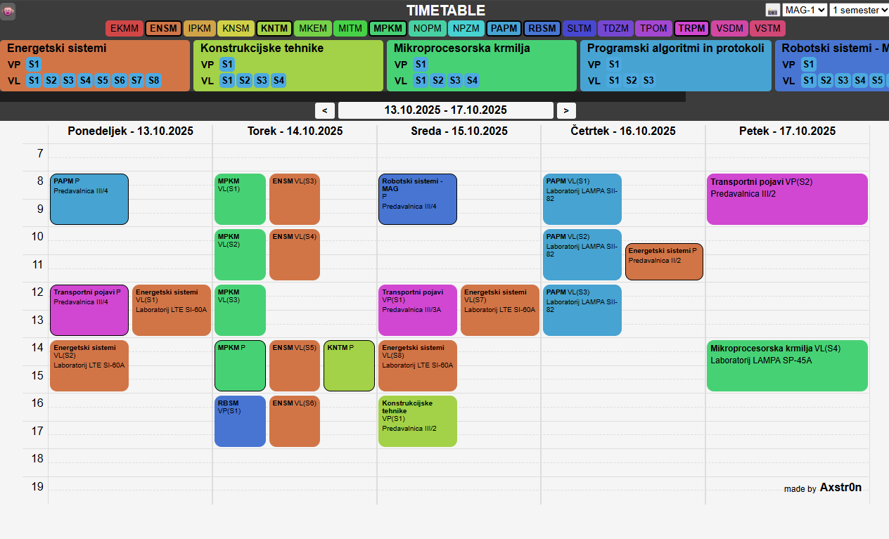

# Timetable-rs

[https://axstr0n.github.io/timetable-rs/](https://axstr0n.github.io/timetable-rs/)



## How to use

### Run the scraper

Navigate to the scraper folder and run:
```
cd scraper
cargo run
```

This executes scraper/src/main.rs and generates static/*.json data. Scraping takes some time.
Scraper scrapes data from https://urnik.fs.uni-lj.si/.

### Run the frontend
From the frontend folder:
```
cd frontend
trunk serve
```
This compiles Yew app to WebAssembly, serves it locally and watches for changes.

Important: Make sure static/*.json exists (generated by scraper) before running trunk serve.

### Build for production

- Frontend:
```
cd frontend
trunk build --release
```

Output will go to frontend/dist/.
